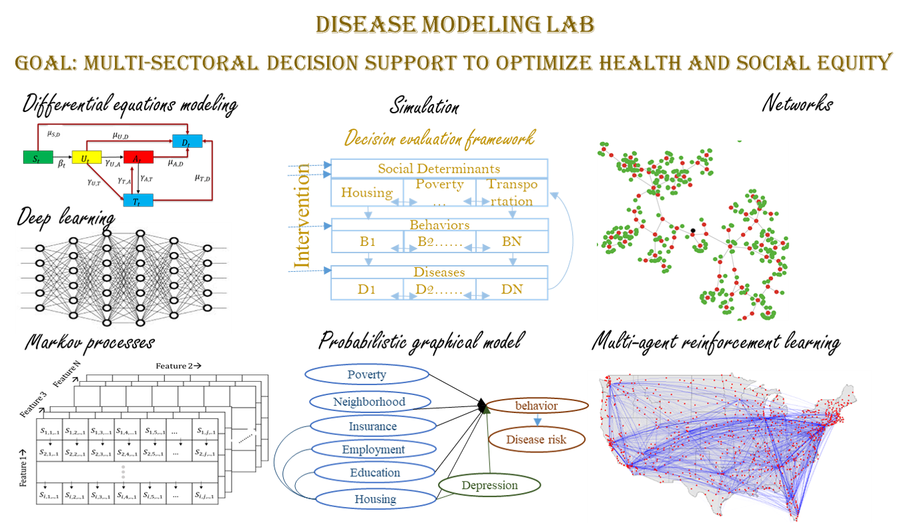

# DISEASE MODELING LAB  
## PI: Chaitra Gopalappa [GoogleScholar](https://scholar.google.com/citations?hl=en&user=zN8ZMOgAAAAJ) | [LinkedIn](https://www.linkedin.com/feed/)
### [PEOPLE](People.md) | [RESEARCH PROJECTS](Projects.md) | [PUBLICATIONS](publications.md) | [AWARDS/FUNDING](Awards.md)    
We develop mathematical and computational models related to disease prediction, prevention, and control analysis to inform public health policy. Our fundamental research is in areas of systems simulation and network modeling, machine learning and artificial intelligence, simulation-based parametric and control optimization, and stochastic processes. Our work focusses on issues of equity, access, and justice. Our recent work includes machine learning and data anlytics to understand the interdependencies between diseases and social determinants of health (SDoH) (e.g., poverty, food and housing insecurity, health access, etc.), integrated simulation and deep learning for joint modeling relalted diseases and SDoH, deep reinforcement learning for identifying optimal resource allocation strategies in dynamic systems including population-level epidemics and individual-level health progression, multi-agent reinforcement learning for cross-jurisidictional intervention analyses, and network modeling and machine learning for early detection of disease outbreaks and rapid response. These research have led to the development of decision analytic tools for evalaution of national and global public health strategies for cancers, HIV, and STIs, in collaboration with the U.S. Centers for Disease Control and Prevention, the World Health Organization, the International Agency for Research on Cancer, and multiple academic institutes. Our ongoing work focusses on evaluating complex cross-agency public policy decisions for initiatives that focus on overall health, social well-being, and equity. Our work is funded by the National Institutes of Health, the National Science Foundation, Centers for Disease control and Prevention, and the World Health Organization.
#### RESEARCH AREA: Simulation, networks, machine learning, reinforcement learning, simulation-based optimization, dynamic programming, stochastic processes
  

